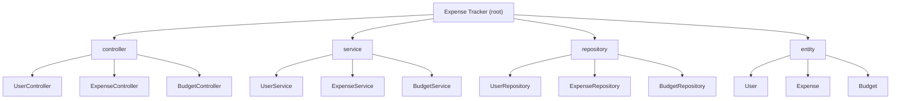

# Expense Tracker

A Spring Boot REST API backend for personal expense tracking and budget management. Users can register, record expenses (with category, amount, date), and set monthly budgets. The application persists data in MySQL via JPA/Hibernate.

## Architecture Overview

- **Type**: Monolithic Spring Boot 3.4.1 web application (Java 17)
- **Pattern**: Controller -> Service -> Repository (standard Spring layered architecture)
- **Database**: MySQL 8+ (`expense-tracker-db`), schema auto-managed by Hibernate
- **Build**: Maven (with Maven Wrapper included)
- **Key Dependencies**: Spring Web, Spring Data JPA, Spring Validation, Lombok, MySQL Connector

## Module Structure



## REST API Endpoints

### User (`/api-users`)

| Method | Path | Description |
|--------|------|-------------|
| POST | `/api-users/register` | Register a new user |
| GET | `/api-users/get-user-data` | Get user data |
| PUT | `/api-users/update-user/{id}` | Update user by ID |
| DELETE | `/api-users/delete-user/{id}` | Delete user by ID |

### Expense (`/api/expenses`)

| Method | Path | Description |
|--------|------|-------------|
| POST | `/api/expenses/add-expense` | Add a new expense |
| PUT | `/api/expenses/update-expense/{id}` | Update expense by ID |
| DELETE | `/api/expenses/delete-expense` | Delete expense (ID in request body) |
| GET | `/api/expenses/expenses/{userId}` | Get all expenses for a user |

### Budget (`/api/budgets`)

| Method | Path | Description |
|--------|------|-------------|
| POST | `/api/budgets/add-budget` | Add a budget |
| PUT | `/api/budgets/update-budget/{id}` | Update budget by ID |
| DELETE | `/api/budgets/delete-budget` | Delete budget (ID in request body) |
| GET | `/api/budgets/budget-data/{userId}/{month}/{year}` | Get budget for user/month/year |

## Data Model

### User (table: `users`)

| Field | Type | Constraints |
|-------|------|-------------|
| id | Long | PK, auto-generated |
| username | String | NOT NULL |
| email | String | NOT NULL |
| password | String | NOT NULL |
| role | String | NOT NULL, default "USER" |
| expense | List\<Expense\> | OneToMany, cascade ALL |

### Expense (table: `expense`)

| Field | Type | Constraints |
|-------|------|-------------|
| id | Long | PK, auto-generated |
| user | User | ManyToOne, FK `user_id`, NOT NULL |
| amount | Double | NOT NULL |
| category | String | NOT NULL |
| description | String | NOT NULL |
| expenseDate | LocalDate | NOT NULL |
| createdAt | LocalDateTime | NOT NULL, default `now()` |

### Budget (table: `budget`)

| Field | Type | Constraints |
|-------|------|-------------|
| id | Long | PK, auto-generated |
| user | User | ManyToOne, FK `user_id`, NOT NULL |
| month | int | NOT NULL |
| year | int | NOT NULL |
| budgetLimit | Double | NOT NULL |
| totalExpense | Double | NOT NULL, default 0.0 |

## Getting Started

### Prerequisites

- Java 17+
- MySQL 8+ running on `localhost:3306`
- Database `expense-tracker-db` must exist

### Build and Run

```bash
# Using Maven Wrapper
./mvnw spring-boot:run

# Or build JAR
./mvnw clean package
java -jar target/expense-tracker-0.0.1-SNAPSHOT.jar
```

### Configuration

Database connection is configured in `src/main/resources/application.properties`. Update the credentials to match your local MySQL setup:

```properties
spring.datasource.url=jdbc:mysql://localhost:3306/expense-tracker-db
spring.datasource.username=root
spring.datasource.password=<your-password>
```

### Run Tests

```bash
./mvnw test
```

## Future Scope

- Authentication and authorization (Spring Security)
- Input validation with Bean Validation annotations
- DTO layer to decouple API from JPA entities
- Global exception handling with `@ControllerAdvice`
- Generate financial reports and analytics
- Build a web or mobile frontend for better usability
- Unit and integration tests
