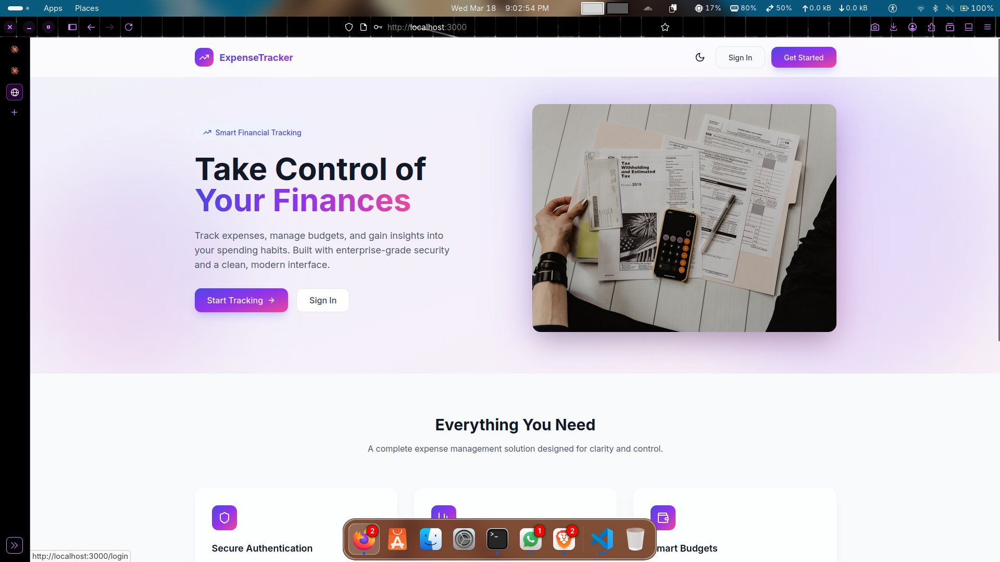
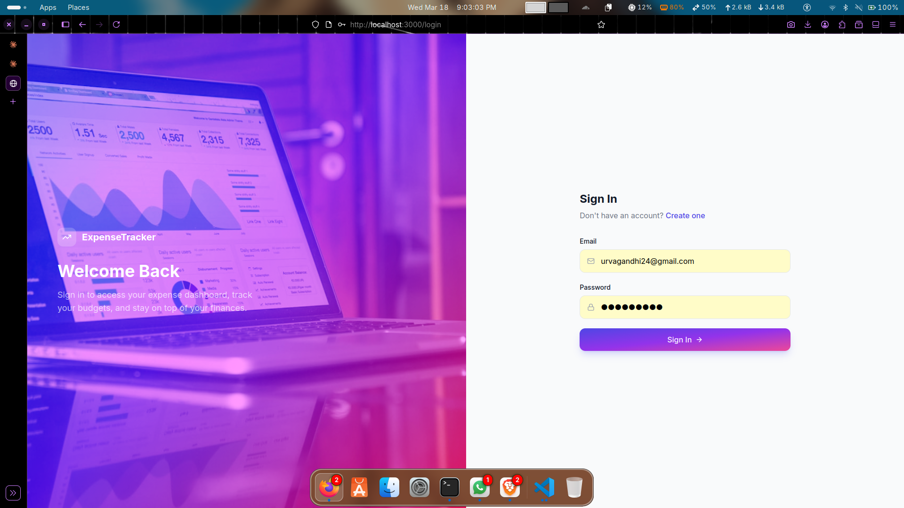
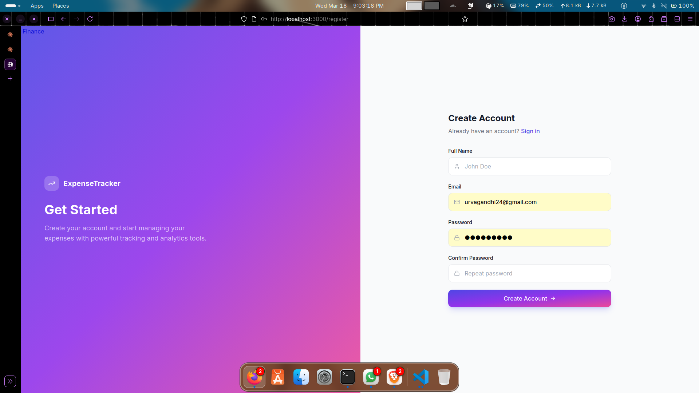
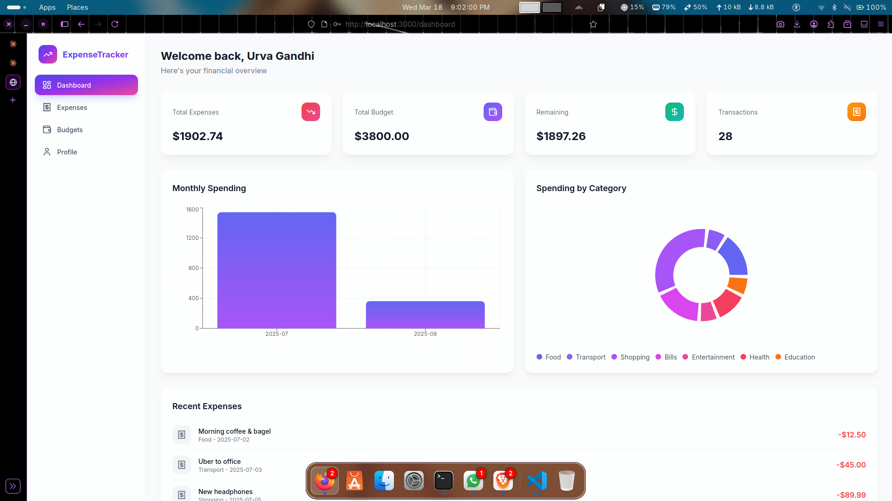
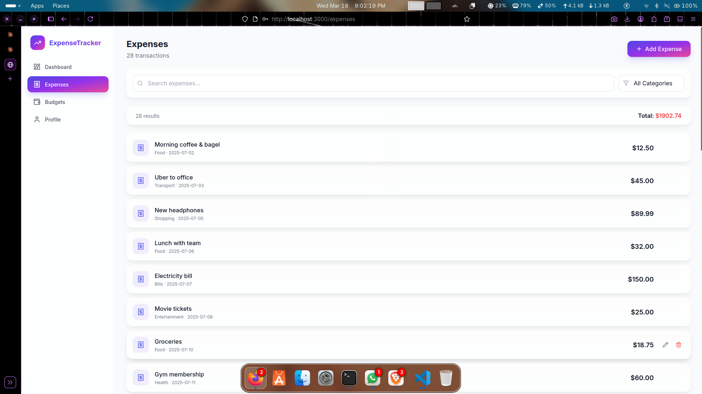
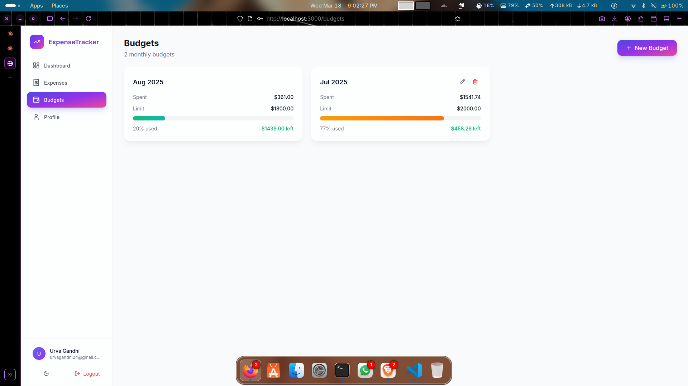
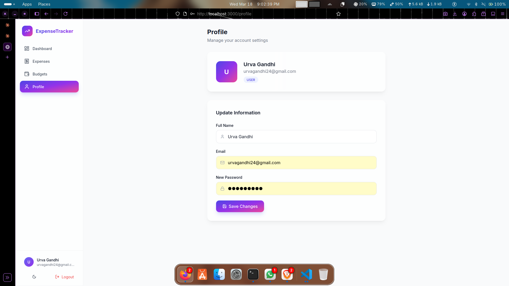
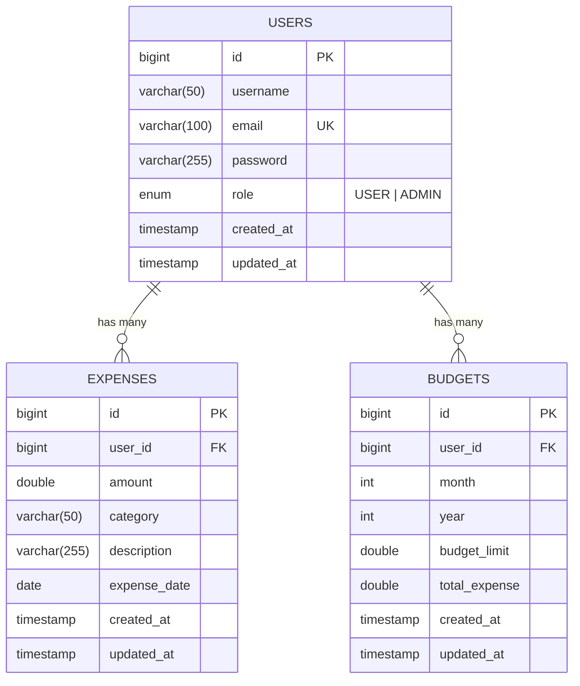

# Expense Tracker

A full-stack personal finance management application built with **Spring Boot 3.4** and **React 18**. Designed with enterprise-grade patterns including stateless JWT authentication, layered DTO architecture, automated budget reconciliation, and a comprehensive test suite with 49 passing tests.

> Backend: Java 17, Spring Security, JPA/Hibernate, PostgreSQL
> Frontend: React, Vite, Tailwind CSS, Recharts
> Testing: JUnit 5, Mockito, MockMvc, H2 (in-memory)

---

## Table of Contents

- [Screenshots](#screenshots)
- [Architecture](#architecture)
- [Tech Stack](#tech-stack)
- [Getting Started](#getting-started)
- [API Reference](#api-reference)
- [Frontend Pages](#frontend-pages)
- [Key Design Decisions](#key-design-decisions)
- [Testing Strategy](#testing-strategy)
- [Database Schema](#database-schema)
- [Demo Credentials](#demo-credentials)

---

## Screenshots

### Landing Page
> Clean hero section with gradient accents, Unsplash imagery, and feature highlights.

<p align="center">
  
</p>

### Authentication
> Split-panel layout with immersive visuals. Client-side validation with real-time feedback.

<p align="center">
  
  
</p>

### Dashboard
> At-a-glance financial overview with stat cards, monthly spending bar chart, category breakdown pie chart, and recent transactions.

<p align="center">
  
</p>

### Expenses
> Full CRUD with inline search, category filtering, and hover-reveal edit/delete actions. Modal forms with validation.

<p align="center">
  
</p>

### Budgets
> Monthly budget cards with color-coded progress bars (green under 70%, orange 70-90%, red over 90%). Real-time remaining balance.

<p align="center">
  
</p>

### Profile
> View and update account information. Avatar with user initials, role badge, and password change support.

<p align="center">
  
</p>

---

## Architecture

```
expense-tracker/
|
+-- backend/                         # Spring Boot REST API
|   +-- src/main/java/.../
|   |   +-- config/                  # SecurityConfig, OpenApiConfig, CorsConfig, DataSeeder
|   |   +-- controller/              # AuthController, UserController, ExpenseController, BudgetController
|   |   +-- dto/
|   |   |   +-- request/             # RegisterRequest, LoginRequest, ExpenseRequest, BudgetRequest
|   |   |   +-- response/            # ApiResponse<T>, AuthResponse, UserResponse, ExpenseResponse, BudgetResponse
|   |   +-- entity/                  # User (implements UserDetails), Expense, Budget, Role enum
|   |   +-- exception/               # ResourceNotFoundException, BadRequestException, DuplicateResourceException, GlobalExceptionHandler
|   |   +-- repository/              # JpaRepository interfaces with custom queries
|   |   +-- security/                # JwtService, JwtAuthenticationFilter
|   |   +-- service/                 # AuthService, UserService (UserDetailsService), ExpenseService, BudgetService
|   +-- src/test/                    # 49 tests across 6 test classes
|   +-- pom.xml
|
+-- frontend/                        # React Single Page Application
|   +-- src/
|   |   +-- api/                     # Axios instance with JWT interceptor
|   |   +-- components/              # Layout, ProtectedRoute, Toast system
|   |   +-- context/                 # AuthContext (login, register, logout, token management)
|   |   +-- pages/                   # Landing, Login, Register, Dashboard, Expenses, Budgets, Profile
|   +-- package.json
|
+-- README.md
```

### Request Lifecycle

```
Client Request
    |
    v
JwtAuthenticationFilter --- extracts Bearer token, validates, sets SecurityContext
    |
    v
@RestController --- @Valid on request DTOs, @AuthenticationPrincipal for current user
    |
    v
@Service --- business logic, ownership checks, DTO mapping
    |
    v
@Repository (JpaRepository) --- PostgreSQL via Hibernate
    |
    v
Response DTO wrapped in ApiResponse<T> --- consistent {success, message, data, timestamp} envelope
```

---

## Tech Stack

### Backend

| Component | Technology | Purpose |
|-----------|-----------|---------|
| Framework | Spring Boot 3.4.1 | Application framework |
| Language | Java 17 | LTS release |
| Security | Spring Security 6 | Authentication and authorization |
| Auth Tokens | jjwt 0.12.6 | JWT generation and validation |
| Password Hashing | BCrypt | One-way hashing with salt |
| ORM | Spring Data JPA / Hibernate 6 | Object-relational mapping |
| Database | PostgreSQL | Primary data store |
| Validation | Jakarta Bean Validation | Input validation on DTOs |
| API Docs | SpringDoc OpenAPI 2.3 | Swagger UI at `/swagger-ui.html` |
| Monitoring | Spring Boot Actuator | Health, info, metrics endpoints |
| Build | Maven | Dependency management and build |

### Frontend

| Component | Technology | Purpose |
|-----------|-----------|---------|
| Framework | React 18 | UI library |
| Build Tool | Vite 6 | Development server and bundler |
| Styling | Tailwind CSS 3 | Utility-first CSS |
| HTTP Client | Axios | API communication with JWT interceptor |
| Routing | React Router v6 | Client-side routing with protected routes |
| Charts | Recharts | Bar and pie chart visualizations |
| Icons | Lucide React | Consistent icon set (no emojis) |
| State | Context API | Authentication state management |

### Testing

| Component | Technology | Purpose |
|-----------|-----------|---------|
| Framework | JUnit 5 | Test runner |
| Mocking | Mockito | Service-layer unit tests |
| Web Layer | MockMvc | Controller integration tests |
| E2E Database | H2 (MySQL mode) | In-memory database for integration tests |
| Security Test | spring-security-test | `@WithMockUser`, CSRF handling |

---

## Getting Started

### Prerequisites

- **Java 17+** (verify: `java --version`)
- **Node.js 18+** (verify: `node --version`)
- **PostgreSQL 14+** (verify: `psql --version`)
- **Maven 3.8+** (verify: `mvn --version`)

### 1. Database Setup

```bash
sudo -u postgres psql -c "CREATE DATABASE expense_tracker_db;"
sudo -u postgres psql -c "CREATE USER your_user WITH PASSWORD 'your_password';"
sudo -u postgres psql -c "GRANT ALL PRIVILEGES ON DATABASE expense_tracker_db TO your_user;"
sudo -u postgres psql -c "ALTER DATABASE expense_tracker_db OWNER TO your_user;"
```

### 2. Backend Configuration

Edit `backend/src/main/resources/application.properties`:

```properties
spring.datasource.url=jdbc:postgresql://localhost:5432/expense_tracker_db
spring.datasource.username=your_user
spring.datasource.password=your_password
```

### 3. Start Backend

```bash
cd backend
mvn spring-boot:run
```

The API starts on **http://localhost:8080**. Hibernate auto-creates tables on first run. The `DataSeeder` populates demo data if the database is empty.

### 4. Start Frontend

```bash
cd frontend
npm install
npm run dev
```

The UI starts on **http://localhost:3000**. Vite proxies all `/api` requests to the backend.

### 5. Run Tests

```bash
cd backend
mvn test
```

All 49 tests run against H2 in-memory (no PostgreSQL dependency for testing).

### 6. API Documentation

Open **http://localhost:8080/swagger-ui.html** for interactive API docs with JWT auth support.

---

## API Reference

All authenticated endpoints require the header: `Authorization: Bearer <token>`

All responses follow a consistent envelope:

```json
{
  "success": true,
  "message": "Description of result",
  "data": { ... },
  "timestamp": "2025-07-15T10:30:00"
}
```

### Authentication

| Method | Endpoint | Body | Response | Auth |
|--------|----------|------|----------|------|
| `POST` | `/api/auth/register` | `{username, email, password}` | JWT token + user info | Public |
| `POST` | `/api/auth/login` | `{email, password}` | JWT token + user info | Public |

### Users

| Method | Endpoint | Description | Auth |
|--------|----------|-------------|------|
| `GET` | `/api/users/me` | Current user profile | Required |
| `GET` | `/api/users/{id}` | Get user by ID | Required |
| `GET` | `/api/users` | List all users | Required |
| `PUT` | `/api/users/{id}` | Update user (partial) | Required |
| `DELETE` | `/api/users/{id}` | Delete user | Required |

### Expenses

| Method | Endpoint | Description | Auth |
|--------|----------|-------------|------|
| `POST` | `/api/expenses` | Create expense | Required |
| `GET` | `/api/expenses` | List expenses (paginated, sorted by date desc) | Required |
| `GET` | `/api/expenses/all` | List all expenses (no pagination) | Required |
| `PUT` | `/api/expenses/{id}` | Update expense | Required |
| `DELETE` | `/api/expenses/{id}` | Delete expense | Required |

### Budgets

| Method | Endpoint | Description | Auth |
|--------|----------|-------------|------|
| `POST` | `/api/budgets` | Create monthly budget | Required |
| `GET` | `/api/budgets` | List all user budgets | Required |
| `GET` | `/api/budgets/{month}/{year}` | Get budget for specific month | Required |
| `PUT` | `/api/budgets/{id}` | Update budget | Required |
| `DELETE` | `/api/budgets/{id}` | Delete budget | Required |

### Validation Error Response

```json
{
  "success": false,
  "message": "Validation failed",
  "data": {
    "email": "Invalid email format",
    "password": "Password must be between 6 and 100 characters"
  },
  "timestamp": "2025-07-15T10:30:00"
}
```

---

## Frontend Pages

| Page | Route | Description |
|------|-------|-------------|
| Landing | `/` | Hero section with gradient, feature cards, call-to-action |
| Login | `/login` | Email/password form with validation |
| Register | `/register` | Registration form with confirm password |
| Dashboard | `/dashboard` | Stat cards, monthly bar chart, category pie chart, recent expenses |
| Expenses | `/expenses` | Full CRUD table with search, category filter, modal forms |
| Budgets | `/budgets` | Monthly budget cards with color-coded progress bars |
| Profile | `/profile` | View and update user information |

### Design System

- **Layout**: Responsive sidebar (desktop) + hamburger menu (mobile)
- **Cards**: Glassmorphism with `backdrop-blur` and subtle borders
- **Colors**: Indigo-to-purple gradient accent palette
- **Theme**: Dark/light mode toggle with system preference detection
- **Icons**: Lucide React (consistent, no emojis)
- **Typography**: Inter font family
- **Images**: Unsplash photography on landing and auth pages

---

## Key Design Decisions

| Decision | Rationale |
|----------|-----------|
| **Stateless JWT** over sessions | Horizontal scalability; no server-side session storage required |
| **DTO layer** (request + response) | Decouples API contract from JPA entities; prevents circular serialization; enables independent validation |
| **`@ControllerAdvice`** global handler | Consistent error format across all endpoints; single place to map exceptions to HTTP status codes |
| **Ownership checks in service layer** | Users can only access their own resources; verified at the business logic level, not just at the URL level |
| **Auto budget reconciliation** | When expenses are added, updated, or deleted, the corresponding monthly budget's `totalExpense` is recalculated automatically via `ExpenseService` |
| **`@Lazy` on PasswordEncoder** in UserService | Breaks the circular dependency: SecurityConfig -> JwtFilter -> UserDetailsService -> PasswordEncoder -> SecurityConfig |
| **H2 with MySQL compatibility mode** for tests | Tests run without any external database; `NON_KEYWORDS=MONTH,YEAR` handles PostgreSQL reserved word conflicts |
| **Vite proxy** instead of CORS-only | Avoids CORS complexity in development; proxy config in `vite.config.js` routes `/api` to Spring Boot |
| **Context API** over Redux | Sufficient for auth state; avoids unnecessary complexity for this scope |

---

## Testing Strategy

### Test Pyramid

```
         /  E2E  \          34 tests -- FullFlowIntegrationTest
        /----------\
       / Integration\        3 tests -- AuthControllerTest (MockMvc + WebMvcTest)
      /--------------\
     /   Unit Tests   \     11 tests -- AuthServiceTest, ExpenseServiceTest, BudgetServiceTest
    /------------------\
   /    Smoke Test      \    1 test  -- Context loads (SpringBootTest + H2)
  /______________________\
```

### What the E2E Suite Covers

The `FullFlowIntegrationTest` boots the full Spring context with H2 and exercises:

- **Auth flow**: Register, duplicate rejection, validation errors, login, wrong password, unauthenticated access
- **User CRUD**: Get profile, get by ID, list all, update, 404 handling
- **Expense CRUD**: Add, validate, paginated list, unpaginated list, update, 404 handling
- **Budget CRUD**: Create, duplicate month rejection, validation, get by month/year, list, 404
- **Budget auto-sync**: Verifies `totalExpense` and `remainingBudget` update when expenses are added or deleted
- **Multi-user isolation**: Second user cannot see or delete first user's expenses
- **Cleanup**: Delete operations and state verification

---

## Database Schema

### ER Diagram



### Table Details

```
+-------------------+       +-------------------+       +-------------------+
|      users        |       |     expenses      |       |     budgets       |
+-------------------+       +-------------------+       +-------------------+
| id          PK    |<------| id          PK    |       | id          PK    |
| username          |  1:N  | user_id     FK    |       | user_id     FK    |----+
| email      UNIQUE |       | amount            |       | month             |    |
| password          |       | category          |       | year              |    |
| role     ENUM     |       | description       |       | budget_limit      |    |
| created_at        |       | expense_date      |       | total_expense     |    |
| updated_at        |       | created_at        |       | created_at        |    |
+-------------------+       | updated_at        |       | updated_at        |    |
        |                   +-------------------+       +-------------------+    |
        |                                                                       |
        +------------------------------- 1:N -----------------------------------+
```

### Indexes

| Table | Index | Columns | Type |
|-------|-------|---------|------|
| `users` | `idx_user_email` | `email` | Unique |
| `expenses` | `idx_expense_user` | `user_id` | Non-unique |
| `expenses` | `idx_expense_date` | `expense_date` | Non-unique |
| `expenses` | `idx_expense_category` | `category` | Non-unique |
| `budgets` | `idx_budget_user_month_year` | `user_id, month, year` | Unique |

---

## Demo Credentials

The `DataSeeder` runs on first startup and creates:

| User | Email | Password | Role | Data |
|------|-------|----------|------|------|
| Urva Gandhi | `urvagandhi24@gmail.com` | `Urva@2004` | USER | 28 expenses, 2 budgets (Jul + Aug) |
| Raj Patel | `raj.patel@example.com` | `Raj@1234` | USER | 12 expenses, 2 budgets |
| Priya Sharma | `priya.sharma@example.com` | `Priya@2025` | USER | 9 expenses, 1 budget |
| Admin | `admin@tracker.com` | `admin123` | ADMIN | No expense data |

---

## License

This project is for educational and portfolio purposes.
